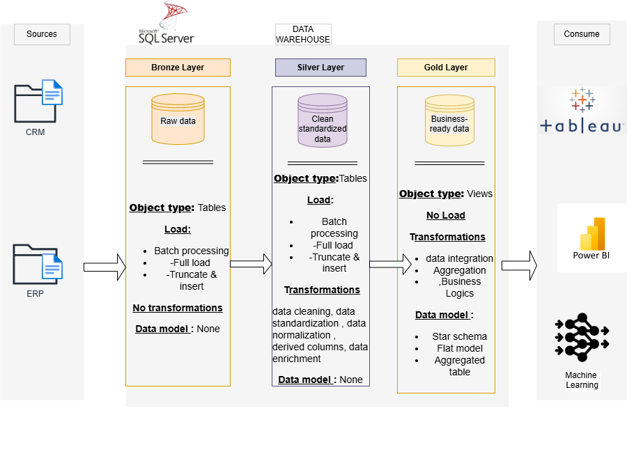

# my-first-data-warehouse
Building a data warehouse with sql server

## 📌Overview
Welcome to my-first-data-warehouse! This repository showcases my first end-to-end data warehousing and analytics project, built with Microsoft SQL Server. As a data enthusiast and aspiring data engineer, I created this project to:

Apply theoretical knowledge in a practical, real-world scenario.
Contribute back to the community (just like many open-source projects helped me learn).
Build a portfolio piece that demonstrates my skills in ETL, data modeling, and SQL.
I hope this project inspires or helps others on their data journey! Feedback and suggestions 

## 🔧 Technologies & Tools

- Database: Microsoft SQL Server
- ETL: SQL Server Integration Services (SSIS)
- Data Modeling: Star Schema
- Visualization: Power BI
- Version Control: Git & GitHub

## 🏗️ Data Architecture

-1-Bronze Layer: Stores raw data as-is from the source systems. Data is ingested from CSV Files into SQL Server Database.
-2-Silver Layer: This layer includes data cleansing, standardization, and normalization processes to prepare data for analysis.
-3-Gold Layer: Houses business-ready data modeled into a star schema required for reporting and analytics.

